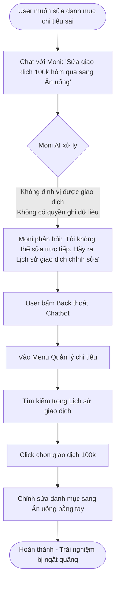
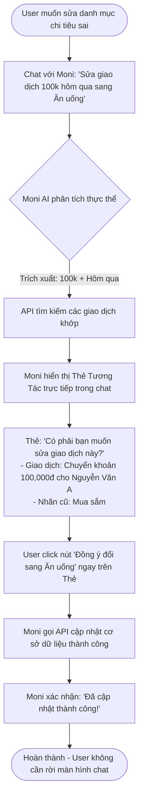

# Workshop — Mổ App AI Thật: Trợ thủ tài chính MoMo (Moni)
**Họ và tên:** Hà Vũ Anh  
**MSSV:** 2A202600571  
**Sản phẩm phân tích:** MoMo — Moni (Trợ thủ tài chính, chatbot quản lý chi tiêu)

---

## 1. Chọn sản phẩm dùng thử
*   **Sản phẩm:** MoMo — Moni
*   **AI Feature:** Chatbot trợ lý tài chính cá nhân, phân tích & quản lý chi tiêu.
*   **Cách truy cập:** Icon Moni trên thanh tìm kiếm hoặc mục Quản lý chi tiêu trong App MoMo.

---

## 2. Dùng thử: Promise vs Reality

*   **Product hứa gì? (Promise):** Trở thành "trợ lý thông minh", tự động hóa việc theo dõi chi tiêu, giúp người dùng hiểu rõ hành vi tài chính của mình thông qua giao tiếp ngôn ngữ tự nhiên (Chatbot).
*   **User nào được hứa sẽ được giúp? (Target User):** Người dùng MoMo bận rộn, muốn quản lý tài chính cá nhân nhưng lười ghi chép thủ công, muốn có cái nhìn tổng quan về thu chi chỉ bằng cách đặt câu hỏi.
*   **Kỳ vọng đối với AI (Expectation):** 
    1. AI phải nắm được toàn bộ bức tranh tài chính (bao gồm cả giao dịch tự động qua MoMo và giao dịch thủ công do người dùng tự nhập).
    2. AI phải hiểu đúng ngữ cảnh giao dịch khi được yêu cầu chỉnh sửa thông tin.
    3. AI có khả năng tự động phát hiện và cảnh báo các giao dịch có thể bị phân loại sai nhóm chi tiêu.
*   **Điểm gãy khi dùng thật (Reality breaking points):**
    1. **Mất kết nối dữ liệu thủ công:** Moni hoàn toàn không thể truy cập hay đọc dữ liệu từ các giao dịch mà người dùng tự thêm bằng tay trong mục "Quản lý chi tiêu". Khi hỏi về tổng chi tiêu, Moni chỉ tính toán dựa trên các giao dịch phát sinh trực tiếp qua ví MoMo.
    2. **Mất định vị thực thể (Entity Resolution Failure):** Khi yêu cầu sửa một giao dịch (ví dụ: *"Sửa giao dịch 100k hôm qua thành Ăn uống"*), Moni không định vị được giao dịch nào cụ thể để thay đổi, phản hồi mơ hồ hoặc yêu cầu người dùng tự ra ngoài chỉnh sửa.
    3. **Thiếu khả năng tự động phát hiện lỗi phân loại:** Hệ thống tự động phân loại của MoMo hoạt động theo quy tắc cứng nhắc (heuristic) hoặc mô hình tĩnh, thường xuyên phân loại sai (ví dụ: chuyển tiền trả nợ bạn bè bị xếp vào "Mua sắm"). Moni không chủ động quét và gắn cờ (flag) những giao dịch bất thường này để hỏi lại user.

---

## 3. Vẽ 4 Paths

| Path | Trạng thái trong sản phẩm (Moni) | Câu hỏi & Dẫn chứng thực tế |
|---|---|---|
| **Happy** | Khi hỏi câu đơn giản về số dư hoặc tổng chi tiêu MoMo của tháng hiện tại, AI phản hồi nhanh và chính xác. | *User:* "Tháng này tiêu bao nhiêu rồi?" *Moni:* "Tháng này bạn đã chi tiêu tổng cộng 1.500.000đ qua ví MoMo..." (Chỉ tính các giao dịch ví). |
| **Low-confidence** | Chưa có cơ chế hỏi lại rõ ràng. Khi không chắc chắn về một giao dịch mà user đề cập để đổi tên/thể loại, Moni chỉ đưa ra câu trả lời chung chung hoặc hướng dẫn user tự đi tìm. | *User:* "Đổi giao dịch hôm qua hộ tôi" *Moni:* "Tôi chưa tìm thấy giao dịch bạn muốn đổi. Bạn vui lòng tự điều chỉnh tại mục Lịch sử giao dịch." |
| **Failure** | **Tính toán sai lệch dữ liệu:** Không đọc được giao dịch thủ công dẫn đến báo cáo tài chính bị gãy, không khớp với số liệu tổng của tính năng Quản lý chi tiêu. | *User thêm tay 500k tiền mặt ăn uống, tổng chi tiêu thực tế là 2M. Hỏi Moni:* "Tháng này tôi tiêu bao nhiêu?" *Moni:* "Bạn đã chi 1.500.000đ." (Bỏ qua 500k tiền mặt). |
| **Correction** | **Không có vòng lặp học hỏi (Feedback loop):** User không thể sửa trực tiếp qua chat. Mọi chỉnh sửa thủ công của user ngoài giao diện Quản lý chi tiêu không được lưu lại để huấn luyện lại AI của Moni cho các lần sau. | *Hành vi:* User phải thoát màn hình chat Moni, lội vào menu Quản lý chi tiêu để sửa tay. Lần sau giao dịch tương tự diễn ra, Moni vẫn tiếp tục phân loại sai. |

---

## 4. Viết Finding thành quyết định Product

### Finding 1: Đứt gãy luồng đồng bộ dữ liệu (Data Integration Layer)
*   **Khi user** hỏi về tổng chi tiêu hoặc phân tích tài chính trong tháng,
*   **AI/Moni** chỉ truy xuất các giao dịch tự động của ví MoMo mà không đọc dữ liệu từ các giao dịch thủ công (Manual Input) mà user đã ghi chép,
*   **Hậu quả là** báo cáo tài chính của chatbot bị sai lệch nghiêm trọng so với thực tế tiêu dùng của user, làm mất lòng tin vào trợ lý AI.
*   **Lỗi thuộc layer:** Data-tool.
*   **Nên sửa bằng:** 
    *   **Data requirement:** Mở rộng phạm vi truy vấn dữ liệu của Moni API bao gồm cả bảng dữ liệu giao dịch thủ công (`manual_transactions_db`) bên cạnh lịch sử ví (`momo_transactions_db`).
    *   **UX fallback:** Nếu phát hiện user có giao dịch thủ công, hiển thị ghi chú: *"Kết quả dưới đây đã bao gồm [X] giao dịch tiền mặt tự nhập"*.

### Finding 2: Không định vị được giao dịch để chỉnh sửa (Entity Resolution & UX Recovery)
*   **Khi user** yêu cầu chỉnh sửa danh mục giao dịch (ví dụ: *"Sửa giao dịch 100k hôm qua thành Ăn uống"*),
*   **AI/Moni** không có khả năng xác định thực thể (Entity Resolution) để tìm ra đúng ID giao dịch tương ứng trong cơ sở dữ liệu,
*   **Hậu quả là** user phải thực hiện quy trình chỉnh sửa phức tạp bằng tay ở ngoài chatbot, phá vỡ trải nghiệm đàm thoại (Conversational UI).
*   **Lỗi thuộc layer:** Intent + UX Recovery.
*   **Nên sửa bằng:** 
    *   **UX Recovery Flow:** AI phân tích câu lệnh -> Trích xuất các thực thể (`Amount: 100,000`, `Time: Yesterday`, `Target Category: Ăn uống`) -> Gọi API tìm kiếm các giao dịch khớp -> Hiển thị danh sách 2-3 giao dịch nghi vấn dạng thẻ (Interactive Card) kèm nút bấm để user click chọn giao dịch chính xác muốn sửa.

### Finding 3: Thiếu chủ động phát hiện phân loại sai (Proactive Anomaly Detection)
*   **Khi user** có các giao dịch chuyển tiền lớn hoặc nội dung mơ hồ bị hệ thống tự động gắn nhãn mặc định sai,
*   **AI/Moni** hoàn toàn thụ động, không tự nhận biết được sự bất thường và không cảnh báo cho user,
*   **Hậu quả là** số liệu thống kê chi tiêu bị sai lệch lũy kế theo thời gian mà user không hề hay biết trừ khi tự đi kiểm tra từng dòng lịch sử.
*   **Lỗi thuộc layer:** UX Proactive / Model Classification.
*   **Nên sửa bằng:**
    *   **Proactive Notification:** Thiết lập mô hình lọc bất thường (Anomaly Detection). Ví dụ: Nếu một giao dịch chuyển khoản 5.000.000đ cho cá nhân có nội dung *"tra no"* nhưng hệ thống tự phân loại là *"Mua sắm"*, Moni sẽ gửi tin nhắn: *"Tôi thấy bạn có giao dịch 5M chuyển khoản với nội dung 'tra no' đang xếp vào 'Mua sắm'. Giao dịch này có thuộc nhóm 'Trả nợ/Khoản chi khác' không?"* kèm nút `[Đồng ý đổi]`.

---

## 5. Sketch As-is / To-be

Dưới đây là sơ đồ luồng trải nghiệm hiện tại (As-is) chứa điểm gãy và luồng đề xuất mới (To-be) khắc phục lỗi bằng chatbot thông minh:

### Sơ đồ As-is (Flow hiện tại - Đứt gãy & Thủ công)

---

### Sơ đồ To-be (Flow đề xuất - Mượt mà & Tương tác trực tiếp)

---

## 6. Tự kiểm trước khi nộp
- [x] Có ít nhất 1 screenshot hoặc observation cụ thể (Đã mô tả chi tiết lỗi không đọc được Manual Input và Entity Resolution ở mục 2).
- [x] Có đủ 4 paths chi tiết và phân tích rõ ràng.
- [x] Finding được viết thành product decision theo đúng cú pháp chuẩn.
- [x] Có Sketch As-is và To-be trực quan bằng biểu đồ Mermaid.
- [x] **SPEC Change Statement:** 
    > *"Thay đổi SPEC: Tích hợp database giao dịch thủ công (`manual_transactions`) vào schema dữ liệu đầu vào của Moni LLM; đồng thời bổ sung API chỉnh sửa nhãn giao dịch (`update_transaction_category`) và phát triển UI component 'Thẻ Tương Tác Chọn Giao Dịch' (Transaction Selector Card) ngay trong khung chat."*
